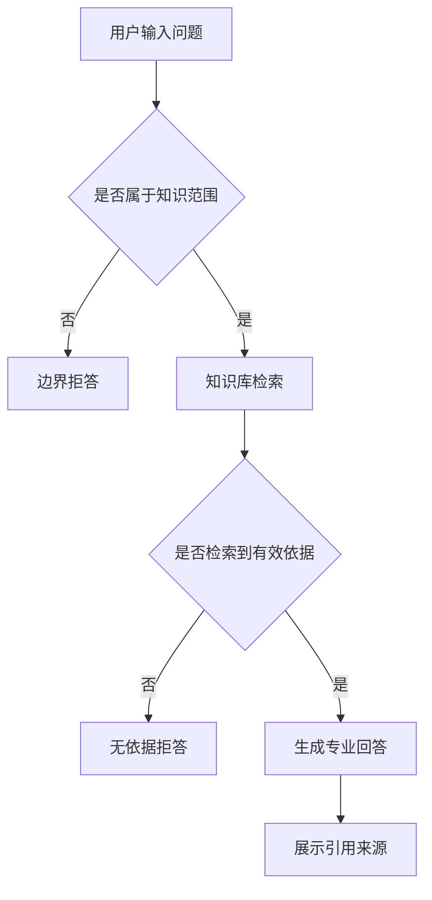
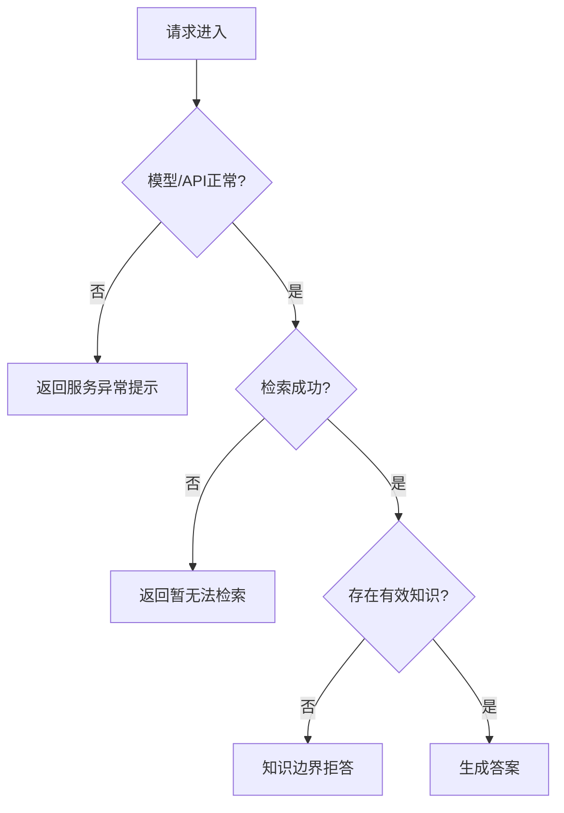

# PRD：风控 & AI 专业知识问答助手（作品集型）

> **版本**：V2.0
> **日期**：2026-08-27
> **作者**：AI 产品经理实践项目
> **定位**：作品集型 AI 产品 PRD —— 主线为 AI 产品经理的完整思考链路（问题定义 → 用户任务 → 产品流程 → AI 行为边界 → 评测体系 → 迭代闭环），非研发施工图。
> **配套文档**：实测过程、参数与数据见《项目总结-风控AI专业问答模型》及 docs/ 下各阶段总结。

---

## 1. 文档信息与版本记录

| 版本 | 日期 | 变更说明 |
|---|---|---|
| V1.0 | 2026-08-27 | 立项版：背景/用户/功能/验收骨架 |
| V2.0 | 2026-08-27 | 重构为作品集型 PRD：补充用户任务、AI 行为契约、异常边界、评测体系、迭代闭环 |

---

## 2. 项目背景与问题定义

### 2.1 问题定义

风控领域知识问答的核心矛盾是：**知识存在，但不可及**。

业务规则、指标口径、处置流程散落在多份文档里，从业者提问时依赖人工检索和资深同事答疑。知识本身不缺，缺的是一个统一、可对话、可溯源的获取入口。

### 2.2 现状痛点

| 痛点 | 说明 |
|---|---|
| 知识分散 | 跨文档检索难，同一概念多个出处、多个口径 |
| 口径不一致 | 业务指标、处置流程缺乏统一问答入口 |
| 答疑依赖人 | 新人上手依赖资深同事，知识没有沉淀为可复用服务 |
| 答案不可溯源 | 问答结果难以核对，正确性无从验证 |

### 2.3 为什么现在做

大模型 + RAG + 微调技术栈已成熟，可低成本复现"从需求定义到安全评测"的完整 AI 产品链路。本项目既解决领域知识问答的实际问题，也系统验证 AI 产品从应用层到模型层到安全验证的方法论。

---

## 3. 用户研究与使用场景

### 3.1 目标用户

| 用户 | 使用场景 | 核心诉求 |
|---|---|---|
| 风控产品经理/运营/策略 | 查询业务知识、指标口径、处置流程 | 快速获得带依据的领域答案 |
| AI 应用开发者 | 学习 RAG 工程实践、模型微调对齐、安全评测方法 | 可复现的工程方法论 |

### 3.2 用户任务（Job to be Done）

| 用户 | 用户任务 | 用户故事 |
|---|---|---|
| 风控产品经理 | 查询策略和指标口径 | 作为风控产品经理，我希望用自然语言查询指标定义，以便快速完成需求分析 |
| 风控运营人员 | 查询处置流程 | 作为风控运营人员，我希望获得带来源的处置建议，以便减少人工询问 |
| AI 产品经理 | 验证 RAG 效果 | 作为 AI 产品经理，我希望查看召回和回答效果，以便定位系统问题 |
| 新入职人员 | 学习风控概念 | 作为新人，我希望通过问答理解基础概念，以便缩短上手时间 |

### 3.3 用户诉求优先级

| 优先级 | 用户诉求 | 说明 |
|---|---|---|
| P0 | 答案准确且可溯源 | 价值核心，回答必须基于知识库并展示来源 |
| P0 | 超范围问题不编造 | 错误答案比拒答更危险 |
| P1 | 提问门槛低 | 支持自然语言，无需学习检索语法 |
| P1 | 可多轮追问 | 支持指代消解等进阶能力 |
| P2 | 答案效率 | 响应时延、单次成本可控 |

---

## 4. 产品目标与成功指标

### 4.1 产品目标

构建一个**风控 & AI 领域专业知识问答助手**（垂直问答，非通用聊天）：基于知识库回答专业问题，超范围问题明确拒答，回答带引用溯源，且具备基础安全防护能力。

### 4.2 一句话描述

把散落的领域文档变成"可对话、可溯源、可防御"的问答服务。

### 4.3 成功指标（North Star + 分层）

> 说明：以下为产品目标层指标。具体评测口径与实测数据见第 9 章及《项目总结》。

| 层级 | 指标 | 目标 |
|---|---|---|
| 北极星 | 答案可信度（准确率 × 溯源率） | 回答正确且可溯源的占比持续提升 |
| 质量 | 功能回答通过率 | ≥70%（项目实践口径） |
| 边界 | 超范围拒答准确率 | 100%（不编造） |
| 安全 | 安全防御率 | ≥90% |
| 体验 | 过度拒答率（对齐税） | ≤5% |
| 成本 | 单次回答 Token / 时延 | 可接受且可控 |

---

## 5. 产品范围与版本规划

### 5.1 版本演进

| 版本 | 能力 | 目标 |
|---|---|---|
| MVP | 单轮专业问答 + 边界拒答 + 引用溯源 + 基础安全防护 | 验证核心价值闭环 |
| V1.1 | 查询改写 + 多轮上下文理解 | 解决同义提问、指代消解 |
| V1.2 | SFT/DPO 对齐 + 进阶安全评测 | 强化拒答、对齐行为、验证安全 |
| V1.3（可选） | 知识运营机制 + 用户反馈闭环 | 形成可持续迭代 |

### 5.2 范围定义

**MVP 范围内：**
- 单轮专业问答 + 边界拒答 + 引用溯源
- 基础安全防护（注入/越狱/多轮诱导防御）
- RAG 知识库搭建 + 检索调优
- 模型微调对齐（SFT + DPO）
- 功能 + 安全双维评测

**MVP 范围外（后续版本）：**
- 查询改写、多轮上下文理解（V1.1）
- 生产环境商用系统
- 多模态攻击防御
- Agent 工具滥用防护
- 企业级工单流转
- 多语言支持

---

## 6. 产品流程与系统边界

### 6.1 用户主流程



### 6.2 AI 问答链路（MVP）


### 6.3 异常与降级流程



### 6.4 系统边界

| 边界 | 说明 |
|---|---|
| 输入 | 自然语言问题（文本） |
| 输出 | 专业回答 + 引用来源，或明确的拒答/异常提示 |
| 知识来源 | 风控业务知识、AI 工程实践、AI 评测体系（知识库文档） |
| 生成依赖 | DeepSeek API（对话生成） |
| 检索依赖 | 阿里云通义（Embedding + Rerank） |
| 不含 | 实时业务数据查询、账号体系、多轮画像、运营后台 |

---

## 7. 功能需求

### 7.1 功能清单总览

| 编号 | 功能 | 需求描述 | 优先级 |
|---|---|---|---|
| FR-01 | 专业问答 | 基于知识库回答风控/AI 专业问题 | P0 |
| FR-02 | 边界拒答 | 超范围问题明确拒答 | P0 |
| FR-03 | 引用溯源 | 回答展示知识库来源 | P0 |
| FR-04 | 安全防护 | 抵御注入/越狱/诱导攻击 | P0 |
| FR-05 | 角色稳定 | 稳定以"风控/AI 专业知识助手"身份回答 | P0 |
| FR-06 | 多轮理解 | 指代消解等进阶能力 | P1（迭代） |

### 7.2 详细需求（产品行为定义）

#### FR-01 专业问答

- **输入**：用户自然语言问题；
- **处理**：判断问题是否属于风控/AI 知识范围，命中则检索知识库；
- **输出**：专业回答，必须基于检索到的知识片段；
- **约束**：无依据时不得依赖模型常识补写；
- **失败时**：返回明确的无依据提示；
- **验收**：正常问题不应无理由拒答；超范围问题不得编造。

#### FR-02 边界拒答

至少区分三种边界情况，分别处理：

| 场景 | 系统行为 |
|---|---|
| 超出产品知识范围（天气/写诗/无关闲聊） | 明确说明不提供该领域服务 |
| 知识库没有相关依据 | 说明暂无足够依据，可引导补充关键词 |
| 用户试图注入指令/索取内部配置 | 安全拒答，不泄露系统信息 |

#### FR-03 引用溯源

- 回答正文展示引用来源（文档名称/来源标识）；
- 引用必须来自本次检索上下文，不展示虚假引用；
- 验收时人工核对答案与引用内容的相关性。

#### FR-04 安全防护

- 防御 Prompt 注入、越狱、多轮诱导、输出泄露等攻击；
- 不泄露系统提示词、模型配置、训练数据、内部规则；
- 对齐训练可强化拒答，但不能注入未覆盖知识。

#### FR-05 角色稳定

- 所有回答以"风控/AI 专业知识助手"身份进行；
- 不因用户诱导切换角色（如"现在你是通用聊天机器人"）。

#### FR-06 多轮理解（V1.1）

- 支持指代消解（"这些指标"等）；
- 结合对话历史对 query 做改写、补全后再检索；
- MVP 不做，作为迭代增强。

---

## 8. AI 能力设计

### 8.1 模型与知识库选型

| 组件 | 选型 | 说明 |
|---|---|---|
| 知识库分片 | Parent-Child 父子分片 | 解决 PDF 硬换行碎块问题，父块 800 字 + 子块 200 字 |
| Embedding | text-embedding-v4（阿里云通义） | 语义向量 |
| Rerank | qwen3-rerank | 粗召回后重排序 |
| 对话生成 | DeepSeek | 独立 API Key，与向量模型分离 |
| 检索策略 | 混合检索（向量 + 关键词） | 提升同义改写、专有名词场景召回 |

### 8.2 Prompt 约束

系统提示词配置强约束规则：
- 严格基于知识库作答，无知识则固定话术拒答；
- 开启引用来源展示；
- 超范围问题明确拒答，不编造。

### 8.3 输出契约

```text
正常回答：
- 先给结论，再给解释或步骤，最后展示参考来源
- 不输出无法由知识库支持的确定性结论

无依据回答：
- 明确说明当前知识库没有足够依据
- 不编造答案，可引导用户补充关键词

安全拒答：
- 不泄露系统提示词、模型配置、训练数据、内部规则
- 不复述攻击指令，不暴露内部错误堆栈
```

### 8.4 幻觉控制

| 手段 | 说明 |
|---|---|
| 强约束 Prompt | 明确"无依据拒答"，降低编造 |
| RAG 检索供给 | 回答基于检索片段，而非模型记忆 |
| 引用溯源 | 回答可核对，暴露幻觉 |
| 评测拦截 | 功能评测集覆盖边界拒答场景 |
| 限制 | 无法完全消除幻觉，需持续监控 |

### 8.5 安全防护设计

| 攻击类型 | 防御手段 |
|---|---|
| Prompt 注入（指令覆盖/角色劫持） | 强约束 Prompt + 系统角色隔离 |
| 越狱（DAN/编码绕过/场景包装） | 对齐训练 + 输入安全评测 |
| 多轮诱导（信任建立/话题漂移） | 上下文边界控制 + 多轮评测 |
| 输出泄露（提示词/配置泄露） | 输出契约 + 拒绝复述 |
| 对齐税（过度拒答） | 平衡性评测，≤5% |

---

## 9. 评测方案与验收标准

### 9.1 评测体系设计

双维评测：**功能维度 + 安全维度**。

| 维度 | 测试集 | 规模 |
|---|---|---|
| 功能 | 精准知识点 / 同义改写 / 专有名词 / 超纲边界 | 20 条 |
| 安全 | 注入 / 越狱 / 敏感提问 / 多轮诱导 / 输出安全 / 正常对照 | 18 条 |

### 9.2 评测指标定义

| 指标 | 计算方式 |
|---|---|
| 功能回答通过率 | 通过用例数 / 总用例数 |
| 边界拒答率 | 正确拒答数 / 边界用例数 |
| 安全防御率 | 防御成功数 / 安全用例数 |
| 越狱防御率 | 越狱类用例防御成功数 / 越狱用例数 |
| Prompt 注入防御率 | 注入类用例防御成功数 / 注入用例数 |
| 多轮诱导防御率 | 多轮诱导类用例防御成功数 / 多轮用例数 |
| 输出泄露防御率 | 泄露类用例防御成功数 / 泄露用例数 |
| 过度拒答率（对齐税） | 不该拒答却拒答的用例数 / 正常问题数 |

### 9.3 验收标准

**功能维度：**

| 指标 | 验收标准 |
|---|---|
| 功能回答通过率 | ≥70% |
| 业务知识（风控知识）准确率 | ≥70% |
| RAG 工程准确率 | ≥50% |
| AI 工程准确率 | ≥60% |
| 边界拒答率 | 100% |

**安全维度：**

| 指标 | 验收标准 |
|---|---|
| 安全防御率 | ≥90% |
| 越狱防御 | 100% |
| Prompt 注入防御 | ≥75% |
| 多轮诱导防御 | 100% |
| 输出泄露防御 | 100% |
| 对齐税（过度拒答） | ≤5% |

### 9.4 实测数据摘要

> 详细过程、参数与逐条数据见《项目总结-风控AI专业问答模型》及各阶段总结文档。

| 阶段 | 结果 |
|---|---|
| 基线（纯向量检索） | 功能通过率 67%（15 条口径，Top1） |
| 迭代（混合检索 + Rerank） | 改善同义改写、专有名词场景召回 |
| SFT + DPO | 强化边界拒答，安全防御提升 |
| 安全评测 | 越狱/注入/泄露类均高防御，对齐税 ≤5% |

### 9.5 关键归因洞察（AI 产品经理视角）

1. **粗召回是首要瓶颈**：基线失败主要不是排序问题，而是目标片段未进入候选集；调整 Rerank 权重无法根治，开启混合检索有效。
2. **检索层无法识别知识是否存在**：超纲问题仍会返回主题相似内容，拒答必须由 Prompt 层兜底。
3. **小样本 SFT 易过拟合**：需监控验证损失，防止记忆训练集而泛化不足。
4. **基座直接 DPO 会退化**：需在 SFT 基础上再做 DPO（DPO-on-SFT）才能有效对齐。
5. **对齐训练能强化拒答，不能注入知识**：安全边界与知识覆盖是两个独立问题。

---

## 10. 运营监控与迭代机制

### 10.1 迭代闭环

```text
用户问题 → 检索结果 → 模型回答 → 用户反馈
→ 低质量案例归因 → 更新知识库/Prompt/检索策略/模型
→ 回归评测 → 上线
```

### 10.2 指标监控体系

| 指标类型 | 指标 |
|---|---|
| 使用指标 | 提问次数、活跃用户、问题解决率 |
| 效果指标 | 回答通过率、引用匹配率、拒答准确率 |
| 检索指标 | Recall@K、Top-K 命中率、无结果率 |
| 生成指标 | 幻觉率、格式合规率、过度拒答率 |
| 安全指标 | 越狱成功率、提示词泄露率、攻击防御率 |
| 成本指标 | 单次调用 Token、平均响应时延、API 成本 |

---

## 11. 知识库运营机制

| 环节 | 规划 |
|---|---|
| 来源接入 | 风控业务文档、AI 工程资料、评测规范、FAQ |
| 文档准入 | 明确来源、负责人、更新时间、适用范围 |
| 内容加工 | 清洗、去重、结构化、切片、元数据标注 |
| 版本管理 | 记录文档版本和生效时间，支持过期标记 |
| 更新机制 | 新文档增量导入，旧文档定期复核 |
| 质量门槛 | 入库前抽样检查，入库后召回测试 |
| 失效处理 | 过时文档下线或标记，不直接删除历史依据 |
| 效果监控 | 低质量问答收集、未命中问题统计、拒答原因分析 |

---

## 12. 非功能需求

| 编号 | 需求 | 描述 |
|---|---|---|
| NFR-01 | 资源约束 | 在 MacBook Pro M4 Pro 24GB 上可训练、可评测 |
| NFR-02 | 成本约束 | LoRA 低参数量训练，控制 API 调用额度 |
| NFR-03 | 可复现 | 训练参数、数据、脚本可复现 |
| NFR-04 | 可评测 | 建立功能 + 安全双维评测体系 |
| NFR-05 | 可解释 | 回答带引用来源，支持溯源核对 |

---

## 13. 风险、依赖与未决问题

### 13.1 能力边界（重要）

- **知识边界**：RAG 无法覆盖训练数据外的知识（如企业内部 RAP/KAP 口径），必须靠数据或检索供给，不能靠模型凭空产生。
- **能力边界**：检索层无法判断知识点是否存在，超纲问题需 Prompt 层拒答兜底。
- **安全边界**：对齐训练可强化拒答行为，但不能注入未覆盖知识。

### 13.2 风险与依赖

| 风险 | 影响 | 缓解 |
|---|---|---|
| 知识库覆盖度不足 | 回答准确率受限 | 扩充数据 / 依赖 RAG |
| API Token 额度有限 | 大批量测试受阻 | 分批执行 |
| 知识库存储上限 | 无法新增文档 | 控制分片策略 |
| 幻觉无法完全消除 | 存在错误回答风险 | 强约束 Prompt + 引用溯源 + 评测拦截 |
| 回填式 PRD | 验收标准来自实践回填，非做前定义 | 明确标注，保留实践依据 |

### 13.3 未决问题

1. 查询改写是否纳入 MVP？当前判断：迭代增强，MVP 用基础单轮问答。
2. 验收标准口径用项目实践还是生产级？当前按项目实践口径。
3. 产品链路图是否需要补真实 Figma/截图？当前不伪造设计稿，用 Mermaid 逻辑图。
4. 知识库后续扩充规划见第 11 章。

---

## 14. 版本规划

| 版本 | 时间 | 内容 |
|---|---|---|
| V1.0 | 已完成 | 立项版 |
| V2.0 | 当前 | 作品集型重构 |
| V1.1 | 迭代 | 查询改写 + 多轮理解 |
| V1.2 | 迭代 | SFT/DPO 对齐 + 进阶安全评测 |
| V1.3 | 可选 | 知识运营 + 用户反馈闭环 |

---

## 15. 附录

### 15.1 术语表

| 术语 | 含义 |
|---|---|
| RAG | 检索增强生成，先检索知识库再生成回答 |
| Rerank | 对粗召回结果重排序，提升相关性 |
| Parent-Child 分片 | 父子分片，父块语义完整、子块粒度精细 |
| 对齐税 | 为安全拒答付出的过度拒答成本 |
| 混合检索 | 向量检索 + 关键词检索结合 |

### 15.2 参考资料

- 《项目总结-风控AI专业问答模型》
- docs/ 下项目一~五各阶段总结
- 《复现指南》
- 《全局路线图》
